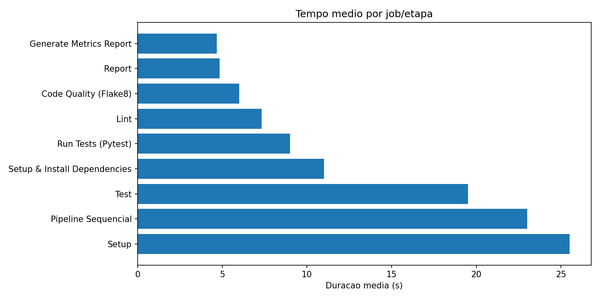
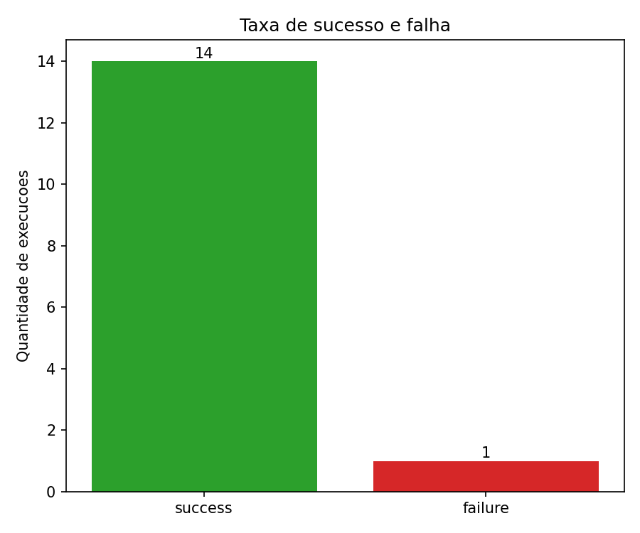
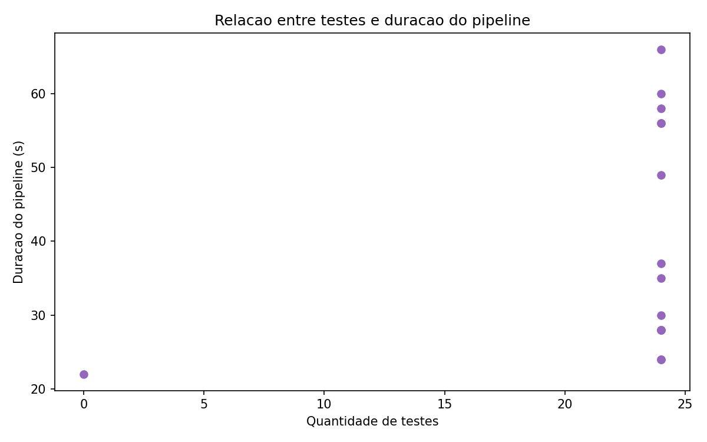

# Relatório técnico — Experimento CI/CD

**Repositório:** https://github.com/milenacasttro/pond-prog-m10-s07  

## Checklist de entrega

| Requisito | Atendido? | Onde |
|-----------|-----------|------|
| Projeto Python com testes pytest | Sim | `src/`, `tests/` |
| Pipeline: install + lint + testes + artefato + métricas | Sim | `ci-paralelo.yml`, `ci-sequencial.yml` |
| ≥ 12 execuções reais | Sim (15) | tabela abaixo + [Actions](https://github.com/milenacasttro/pond-prog-m10-s07/actions) |
| Variações controladas | Parcial | seção 2.2 |
| Script Python coletando via API (não manual) | Sim | `Entregaveis/coletar_metricas.py` |
| CSV com estrutura exigida + `test_avg_time` | Sim | `Entregaveis/dados/metricas.csv` |
| Tempo por etapa (step) | Sim | `Entregaveis/dados/metricas_etapas.csv` |
| 4 gráficos obrigatórios | Sim | `Entregaveis/graficos/` |
| 8 perguntas de análise | Sim | seção 4 |
| Links/IDs reais, commits, variações | Sim | seções 2 e 2.2 |
| ≥ 2 resultados inesperados | Sim | seção 5 |
| Hipótese vs resultado | Sim | seção 6 |
| Limitações | Sim | seção 4.7 |
| Como reproduzir | Sim | `Entregaveis/como_reproduzir.md` |

**IDs dos workflows no GitHub:**
- CI Paralelo: `290971128` — https://github.com/milenacasttro/pond-prog-m10-s07/actions/workflows/ci-paralelo.yml
- CI Sequencial: `290971129` — https://github.com/milenacasttro/pond-prog-m10-s07/actions/workflows/ci-sequencial.yml
- CI Pipeline (legado): `290939148` — removido do repo, runs históricos ainda visíveis

## 1. Objetivo

Medir o comportamento de dois pipelines no GitHub Actions — um com jobs paralelos e cache (`ci-paralelo.yml`) e outro sequencial sem cache (`ci-sequencial.yml`) — usando uma API Flask com 24 testes pytest.

## 2. Configuração do experimento

### Workflows

| Variante | Arquivo | Estrutura | Cache |
|----------|---------|-----------|-------|
| Paralelo | [ci-paralelo.yml](https://github.com/milenacasttro/pond-prog-m10-s07/blob/main/.github/workflows/ci-paralelo.yml) | Setup → Lint + Test (paralelo) → Report | Sim (pip) |
| Sequencial | [ci-sequencial.yml](https://github.com/milenacasttro/pond-prog-m10-s07/blob/main/.github/workflows/ci-sequencial.yml) | Job único: install → lint → test → artefato | Não |

### Hipótese inicial

Eu esperava que o pipeline paralelo com cache fosse mais rápido no tempo total, e que a partir da segunda execução o cache reduzisse visivelmente o tempo de instalação.

### Execuções analisadas (15 runs)

| # | Run ID | Workflow | Commit | Status | Duração (s) | Link |
|---|--------|----------|--------|--------|-------------|------|
| 1 | 27104703898 | ci-pipeline.yml (legado) | `dfb587d` | failure | 22 | [run](https://github.com/milenacasttro/pond-prog-m10-s07/actions/runs/27104703898) |
| 2 | 27104741325 | ci-pipeline.yml (legado) | `4110f88` | success | 37 | [run](https://github.com/milenacasttro/pond-prog-m10-s07/actions/runs/27104741325) |
| 3 | 27104982443 | ci-pipeline.yml (legado) | `2605d14` | success | 35 | [run](https://github.com/milenacasttro/pond-prog-m10-s07/actions/runs/27104982443) |
| 4 | 27107013532 | ci-paralelo.yml | `cf6bdb5` | success | 66 | [run](https://github.com/milenacasttro/pond-prog-m10-s07/actions/runs/27107013532) |
| 5 | 27107013533 | ci-sequencial.yml | `cf6bdb5` | success | 24 | [run](https://github.com/milenacasttro/pond-prog-m10-s07/actions/runs/27107013533) |
| 6 | 27107137267 | ci-paralelo.yml | `cf6bdb5` | success | 58 | [run](https://github.com/milenacasttro/pond-prog-m10-s07/actions/runs/27107137267) |
| 7 | 27107137725 | ci-sequencial.yml | `cf6bdb5` | success | 28 | [run](https://github.com/milenacasttro/pond-prog-m10-s07/actions/runs/27107137725) |
| 8 | 27107147454 | ci-paralelo.yml | `cf6bdb5` | success | 49 | [run](https://github.com/milenacasttro/pond-prog-m10-s07/actions/runs/27107147454) |
| 9 | 27107147937 | ci-sequencial.yml | `cf6bdb5` | success | 28 | [run](https://github.com/milenacasttro/pond-prog-m10-s07/actions/runs/27107147937) |
| 10 | 27107156237 | ci-paralelo.yml | `cf6bdb5` | success | 60 | [run](https://github.com/milenacasttro/pond-prog-m10-s07/actions/runs/27107156237) |
| 11 | 27107158002 | ci-sequencial.yml | `cf6bdb5` | success | 24 | [run](https://github.com/milenacasttro/pond-prog-m10-s07/actions/runs/27107158002) |
| 12 | 27107168659 | ci-paralelo.yml | `cf6bdb5` | success | 56 | [run](https://github.com/milenacasttro/pond-prog-m10-s07/actions/runs/27107168659) |
| 13 | 27107169126 | ci-sequencial.yml | `cf6bdb5` | success | 30 | [run](https://github.com/milenacasttro/pond-prog-m10-s07/actions/runs/27107169126) |
| 14 | 27107179219 | ci-paralelo.yml | `cf6bdb5` | success | 56 | [run](https://github.com/milenacasttro/pond-prog-m10-s07/actions/runs/27107179219) |
| 15 | 27107179506 | ci-sequencial.yml | `cf6bdb5` | success | 28 | [run](https://github.com/milenacasttro/pond-prog-m10-s07/actions/runs/27107179506) |

**Variações entre execuções (mapeamento com o enunciado):**

| Variação pedida no enunciado | O que fiz | Run / commit de referência |
|------------------------------|-----------|----------------------------|
| Commit com pipeline passando | Push com lint e 24 testes ok | `4110f88`, `2605d14`, `cf6bdb5` — ex.: run 27107179506 |
| Commit com falha | Actions v3 depreciada quebrou upload | `dfb587d` — run [27104703898](https://github.com/milenacasttro/pond-prog-m10-s07/actions/runs/27104703898) |
| Aumento de testes | Suite cresceu de ~0 para 24 testes ao longo do repo (`6ed0875` → `cf6bdb5`); reruns usam 24 fixos | runs 4–15 com `test_count=24` |
| Teste lento | Não isolei um teste com `sleep` longo | *limitação documentada na 4.7* |
| Cache de dependências | Paralelo com cache pip vs sequencial sem cache | compare runs 27107179219 (cache) vs 27107179506 (sem) |
| Ordem dos jobs | Pipeline legado (4 jobs encadeados) vs paralelo vs job único | runs 27104982443 vs 27107179219 vs 27107179506 |
| Jobs sequenciais vs paralelos | Dois YAML distintos no mesmo commit | `ci-paralelo.yml` vs `ci-sequencial.yml` |
| Repetição controlada | 10 execuções extras via `workflow_dispatch` | runs 27107137267–27107179506 |

Detalhe adicional:
- Runs 1–3: pipeline antigo (`ci-pipeline.yml`), incluindo a falha inicial.
- Runs 4–5: primeiro push após refatoração (cache frio no paralelo).
- Runs 6–15: dez execuções via `Entregaveis/disparar_runs.py` no commit `cf6bdb5`.

Dados: `Entregaveis/dados/metricas.csv` (por job) e `metricas_etapas.csv` (por step).

## 3. Gráficos

### Tempo total por execução

### Tempo por job

### Taxa de sucesso e falha

### Testes vs duração

## 4. Respostas às perguntas de análise

### 4.1 Qual etapa mais contribuiu para o tempo total do pipeline?

No workflow **paralelo**, o job **Setup** domina: média de 25,5 s por execução, enquanto Lint fica em ~7 s e Test em ~19 s. Dentro do Setup, a etapa **Instalar dependencias** concentra a maior parte (visível em `metricas_etapas.csv`).

No workflow **sequencial**, **Instalar dependencias** dentro do job único consome ~15–18 s de ~27 s totais. Lint e pytest em si ficam abaixo de 2 s cada.

### 4.2 Houve diferença significativa entre execuções com e sem cache?

Sim, mas só ficou claro comparando a **primeira** execução paralela com as seguintes.

- Run 27107013532 (primeiro paralelo): Setup com **36 s**
- Runs seguintes (27107137267, 27107168659…): Setup entre **19–26 s**

Ou seja, o cache aqueceu e cortou ~10 s na instalação. Porém o workflow sequencial **sem cache** manteve ~24–30 s de forma estável — menos que o paralelo mesmo com cache, porque evita subir 4 runners separados.

### 4.3 O paralelismo reduziu o tempo total? Em que condições?

**Não neste projeto.** Médias observadas:

| Workflow | Duração média |
|----------|---------------|
| ci-paralelo.yml | 57,5 s |
| ci-sequencial.yml | 27,0 s |
| ci-pipeline.yml (legado) | 31,3 s |

O paralelismo só compensaria se Lint e Test fossem longos o suficiente para amortizar o custo de 4 jobs (checkout, setup-python e fila de runner em cada um). Com 24 testes que rodam em ~2 s, o overhead de orquestração pesa mais que o ganho.

O paralelismo faria sentido com suite de testes de integração (> 5 min) ou matriz de versões Python.

### 4.4 Quais falhas foram mais frequentes?

Das 15 execuções, **1 falha (6,7%)**:

- Run **27104703898** — commit `dfb587d` — pipeline legado falhou porque `actions/upload-artifact@v3` estava depreciado. Corrigido no commit `4110f88`.

Nos workflows novos, **0 falhas** em 12 runs.

### 4.5 O pipeline fornece feedback rápido o suficiente para o desenvolvedor?

O **sequencial** entrega resultado em ~27 s — aceitável para um push em projeto pequeno. O desenvolvedor vê lint e testes na mesma página, num job só.

O **paralelo** demora ~57 s para o workflow completo, mas Lint e Test ficam prontos por volta dos ~45 s (após Setup). Para feedback rápido de lint, o sequencial é melhor neste cenário.

### 4.6 Que melhorias poderiam ser feitas no pipeline?

1. **Unificar em um job** para projetos pequenos — elimina overhead de múltiplos runners.
2. **Remover o job Setup separado** no paralelo; cada job já faz checkout + install.
3. **Cache compartilhado** entre workflows (actions/cache com mesma key).
4. **Fail-fast no lint** antes de instalar todas as deps de teste no sequencial (instalar só flake8 primeiro).
5. **Matriz de Python** só quando houver compatibilidade real a testar.

### 4.7 Quais limitações existem nos dados coletados?

- Runs 6–15 repetem o **mesmo commit** (`cf6bdb5`) — servem para medir estabilidade do runner, não mudança de código.
- Não rodei um commit dedicado só com **teste lento** (`sleep` artificial).
- Run de falha (27104703898) veio do pipeline **legado**, não de teste pytest falhando nos workflows novos.
- Métricas vêm da API do GitHub (granularidade de segundos, fila incluída no tempo de job).
- `test_avg_time` depende do JUnit nos artefatos — exige token na coleta.
- Gráfico testes × duração fica plano porque a suite ficou em 24 testes nas execuções novas.

### 4.8 Como essa análise poderia apoiar decisões de engenharia?

Os números mostram que **paralelizar cedo demais custa caro**. Para este repo, manter um job sequencial com cache pip é a opção mais barata (~27 s vs ~57 s).

Se o time crescer a suite ou adicionar testes de integração, eu reavaliaria paralelismo com base em dados — o script `coletar_metricas.py` permite repetir a medição a cada mudança estrutural.

Também documentei que falhas de **actions desatualizadas** quebram o pipeline inteiro; fixar versões (`@v4`) e habilitar Dependabot para actions reduz risco.

## 5. Resultados inesperados

**1. Paralelo mais lento que sequencial**  
Eu assumia o contrário. O motivo é o custo fixo de 4 máquinas virtuais independentes. Lint + Test juntos duram ~25 s, mas o workflow paralelo leva ~57 s porque paga Setup + fila + checkout quatro vezes.

**2. Primeiro run paralelo não foi o mais lento**  
O run 27107013532 (primeiro após refatoração) teve Setup de 36 s, mas runs posteriores como 27107156237 (60 s total) foram piores por variação de runner — o cache ajudou a instalação, mas a fila do GitHub Actions oscilou.

## 6. Hipótese vs resultado

| Expectativa | Resultado |
|-------------|-----------|
| Paralelo + cache seria mais rápido | Sequencial ~2× mais rápido (27 s vs 57 s) |
| Cache reduziria tempo a cada run | Redução parcial no Setup (~10 s), mas não superou overhead paralelo |
| Mais testes = pipeline mais lento | Não testável — suite fixa em 24 testes |

## 7. Conclusão

Para a API Flask deste repositório, o pipeline **sequencial sem cache** é a configuração mais eficiente. O paralelismo só se justificaria com jobs substancialmente mais pesados.

A coleta automatizada via API (`Entregaveis/coletar_metricas.py`) funcionou bem com token e permitiu comparar 15 execuções reais sem dados inventados.

## 8. Entregáveis

| Item | Local |
|------|-------|
| Repositório | https://github.com/milenacasttro/pond-prog-m10-s07 |
| YAML paralelo | https://github.com/milenacasttro/pond-prog-m10-s07/blob/main/.github/workflows/ci-paralelo.yml |
| YAML sequencial | https://github.com/milenacasttro/pond-prog-m10-s07/blob/main/.github/workflows/ci-sequencial.yml |
| Script de coleta | `Entregaveis/coletar_metricas.py` |
| Base de dados (jobs) | `Entregaveis/dados/metricas.csv` |
| Base de dados (etapas) | `Entregaveis/dados/metricas_etapas.csv` |
| Gráficos | `Entregaveis/graficos/` |
| Reprodução | `Entregaveis/como_reproduzir.md` |
